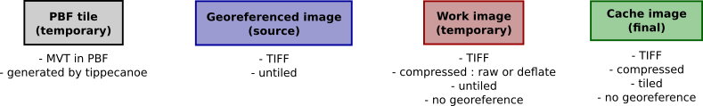

# Suite d'outils de génération de dalles raster et vecteur

- [Récupération du projet](#récupération-du-projet)
- [Variables CMake](#variables-cmake)
- [Dépendances à la compilation](#dépendances-à-la-compilation)
- [Compilation et installation](#compilation-et-installation)
- [Dépendances à l'exécution](#dépendances-à-lexécution)
- [Présentation des outils](#présentation-des-outils)
  - [CACHE2WORK](#cache2work)
    - [Usage](#usage)
    - [Exemples](#exemples)
  - [CHECKWORK](#checkwork)
    - [Usage](#usage-1)
    - [Exemple](#exemple)
  - [COMPOSENTIFF](#composentiff)
    - [Usage](#usage-2)
    - [Exemple](#exemple-1)
  - [DECIMATENTIFF](#decimatentiff)
    - [Usage](#usage-3)
    - [Exemple](#exemple-2)
  - [MANAGENODATA](#managenodata)
    - [Usage](#usage-4)
    - [Exemples](#exemples-1)
  - [MERGE4TIFF](#merge4tiff)
    - [Usage](#usage-5)
    - [Exemples](#exemples-2)
  - [MERGENTIFF](#mergentiff)
    - [Usage](#usage-6)
    - [Exemples](#exemples-3)
  - [OVERLAYNTIFF](#overlayntiff)
    - [Usage](#usage-7)
    - [Exemple](#exemple-3)
  - [PBF2CACHE](#pbf2cache)
    - [Usage](#usage-8)
    - [Exemple](#exemple-4)
  - [WORK2CACHE](#work2cache)
    - [Usage](#usage-9)
    - [Exemples](#exemples-4)

## Récupération du projet

`git clone --recursive https://github.com/rok4/generation`

## Variables CMake

* `OBJECT_ENABLED` : active la compilation des classes de gestion des stockages objet
* `KDU_ENABLED` : active la compilation avec le driver Kakadu pour la lecture des fichiers JPEG2000

## Dépendances à la compilation

* Submodule GIT
  * `https://github.com/rok4/core-cpp`
* Paquets debian
  * zlib1g-dev
  * libcurl4-openssl-dev
  * libproj-dev
  * libssl-dev
  * libturbojpeg0-dev
  * libjpeg-dev
  * libc6-dev
  * libjson11-1-dev
  * libboost-log-dev
  * libboost-filesystem-dev
  * libboost-system-dev
  * libsqlite3-dev
  * Si `KDU_ENABLED` à 0
    * libopenjp2-7-dev
  * libpng-dev
  * libtiff5-dev
  * Si `OBJECT_ENABLED` à 1
    * librados-dev

## Compilation et installation

```shell
mkdir build && cd build
cmake -DCMAKE_INSTALL_PREFIX=/ -DBUILD_VERSION=0.0.1 -DOBJECT_ENABLED=1 ..
make
make install
```

## Dépendances à l'exécution

* Dépôt GIT
    * `https://github.com/rok4/styles`

## Présentation des outils

Écrits en C++.

Voici la légende utilisée pour identifié le format des images dans les documentations par commande :



### CACHE2WORK


Cet outil lit une dalle ROK4 raster et la convertit en une image TIFF non tuilée, dont on peut choisir la compression.

#### Usage

`cache2work -c <COMPRESSION> <INPUT FILE/OBJECT> <OUTPUT FILE> [-pool <POOL NAME>|-bucket <BUCKET NAME>|-container <CONTAINER NAME>] [-d]`

* `-c <COMPRESSION>` : compression des données dans l'image TIFF en sortie : jpg, jpg90, raw (défaut), zip, lzw, pkb
* `-pool <POOL NAME>` : précise le nom du pool CEPH dans lequel lire la dalle
* `-bucket <BUCKET NAME>` : précise le nom du bucket S3 dans lequel lire la dalle
* `-container <CONTAINER NAME>` : précise le nom du conteneur SWIFT dans lequel lire la dalle
* `-d` : activation des logs de niveau DEBUG


#### Exemples

* `cache2work -c zip /home/IGN/slab.tif /home/IGN/workimage.tif`
* `cache2work -c zip -pool ign slab /home/IGN/workimage.tif`

### CHECKWORK

Cet outil prend seulement une image en entrée et tente de la lire. Cela permet de détecter d'éventuelles erreurs.

#### Usage

`checkWork <INPUT FILE> [-h]`

* `-h` : Affiche l'aide

#### Exemple

* `checkWork /home/IGN/source.tif`

### COMPOSENTIFF


Cet outil fusionne plusieurs images disposées en un dallage régulier en une seule. Il est utilisé lorsqu'une image est moissonnée en plusieurs fois à cause de sa taille, pour recomposer l'image désirée. Toutes les images en entrée doivent voir les même dimensions et les même caractéristiques.

#### Usage

`composeNtiff -s <DIRECTORY> -g <VAL> <VAL> -c <VAL> <OUTPUT FILE> [-d]`

* `-s` : dossier contenant toutes les images du quadrillage. Elles sont lues dans l'ordre alpha-numérique. Si il a plus d'images que nécessaires, les dernières ne sont pas utilisées
* `-c <COMPRESSION>` : compression des données dans l'image TIFF en sortie : jpg, jpg90, raw (défaut), zip, lzw, pkb
* `-g <INTEGER> <INTEGER>` : largeur et hauteur de la grille en nombre d'images
* `-d` : activation des logs de niveau DEBUG

#### Exemple

* `composeNtiff -c zip -s /home/IGN/tiles/ -g 4 4 /home/IGN/workimage.tif`

### DECIMATENTIFF


Cet outil génère une image à partir de plusieurs image en phase entre elles (même résolution et même décalage) en ne gardant qu'un pixel sur N. Cet outil est utilisé pour générer une dalle d'un niveau à partir de dalles d'un niveau inférieur dans le cas d'une pyramide utilisant un TileMatrixSet "plus proche voisin" (une valeur de la donnée source n'est pas interpolée et se retrouve dans les niveaux supérieurs). Le centre d'un pixel de l'image de sortie doit être aligné avec un pixel d'une image en entrée. Le niveau de décimation (N) est déduit de la différence de résolution entre les entrées et la sortie.

Les informations sur les canaux (nombre, taille en bits et format) peuvent :

* être fournies et des conversions à la volée seront potentiellement faites sur les images n'ayant pas les mêmes
* ne pas être fournies, auquel cas toutes les images en entrée doivent avoir les même caractéristiques

#### Usage

`decimateNtiff -c <COMPRESSION> <INPUT FILE> <OUTPUT FILE>  [-d]`

* `-f <FILE>` : fichier de configuration contenant l'image en sortie et la liste des images en entrée, avec leur géoréférencement et les masques éventuels
* `-c <COMPRESSION>` : compression des données dans l'image TIFF en sortie : jpg, jpg90, raw (défaut), zip, lzw, pkb
* `-n <COLOR>` : couleur de nodata, valeurs décimales pour chaque canal, séparées par des virgules (exemple : 255,255,255 pour du blanc sans transparence)
* `-a <FORMAT>` : format des canaux : float, uint
* `-b <INTEGER>` : nombre de bits pour un canal : 8, 32
* `-s <INTEGER>` : nombre de canaux : 1, 2, 3, 4
* `-d` : activation des logs de niveau DEBUG

Les options a, b et s doivent être toutes fournies ou aucune.

##### Le fichier de configuration

Une ligne du fichier de configuration a la forme suivante : `IMG <CHEMIN> <XMIN> <YMAX> <XMAX> <YMIN> <RESX> <RESY>` pour une image de donnée ou `MSK <CHEMIN>` pour une image de masque.

Par exemple : `IMG /home/IGN/image.tif 10 150 110 50 0.5 0.5`. Si  on veut associer à cette image un masque, on mettra sur la ligne suivante `MSK /home/IGN/masque.tif`. Une ligne de masque doit toujours suivre une ligne d'image.

La première image listée sera la sortie (avec éventuellement son masque). Les suivantes sont les images en entrée. La première entrée peut être une image de fond, compatible avec celle de sortie et non avec les autres images en entrée (qui seront décimées). Seulement dans ce cas nous avons une entrée non compatible avec les autres.

Exemple de configuration :
```
IMG /home/IGN/IMAGE.tif -499    1501    1501    -499    2       2
MSK /home/IGN/MASK.tif
IMG /home/IGN/sources/imagefond.tif -499    1501    1501    -499    2       2
MSK /home/IGN/sources/maskfond.tif
IMG /home/IGN/sources/image1.tif 0       1000    1000    0       1       1
IMG /home/IGN/sources/image2.tif 500     1500    1500    500     1       1
MSK /home/IGN/sources/mask2.tif
```
L'image `/home/IGN/IMAGE.tif` sera écrite ainsi que son masque associé `/home/IGN/MASK.tif`

#### Exemple

* `decimateNtiff -f conf.txt -c zip -n -99999`

### MANAGENODATA


Cet outil permet d'identifier et de modifier une couleur dans une image considérée comme du nodata. Il permet également d'écrire le masque associé à l'image sur la base de cette valeur de nodata, et de réserver cette valeur au nodata (modification des pixels de données de cette couleur en une autre). Dans ce dernier cas, un pixel de nodata est un pixel de la couleur cible "relié au bord" (on proprage le nodata depuis les pixels de la couleur cible en bord d'image).

#### Usage

`manageNodata -target <VAL> [-tolerance <VAL>] [-touch-edges] -format <VAL> [-nodata <VAL>] [-data <VAL>] <INPUT FILE> [<OUTPUT FILE>] [-mask-out <VAL>] [-d]`

* `-target <COLOR>` : couleur cible, permettant d'identifier le nodata
* `-tolerance <INTEGER>` : delta de tolérance autour de la couleur cible
* `-touche-edges` : précise que le nodata a la couleur cible et "est relié au bord".
* `-data <COLOR>` : nouvelle couleur pour la donnée, afin de réserver la couleur cible au nodata. N'a de sens qu'avec l'option -touch-edges
* `-nodata <COLOR>` : nouvelle couleur pour le nodata
* `-mask-out <FILE>` : chemin vers le masque à écrire, associé à l'image en entrée. Si aucun pixel de nodata n'est trouvé, le masque n'est pas écrit
* `-format <FORMAT>` : format des canaux : uint8, float32
* `-channels <INTEGER>` : nombre de canaux
* `-d` : activation des logs de niveau DEBUG

L'image en entrée n'est modifiée que si une nouvelle couleur de donnée ou de nodata différente de la couleur cible est précisée, et qu'aucune image en sortie n'est précisée.

#### Exemples

* `manageNodata -target 255,255,255 -touch-edges -data 254,254,254 input_image.tif output_image.tif -channels 3 -format uint8`
* `manageNodata -target -99999 -tolerance 10 input_image.tif -mask-out mask.tif -channels 1 -format float32`

### MERGE4TIFF


Cet outil génère une image à partir 4 images de même dimension disposées en carré, en moyennant les pixels 4 par 4. L'image en sortie a les dimensions des images en entrée. Une image à utiliser comme fond peut être donnée. Il est possible de préciser une valeur de gamma pour exagérer les contrastes. Cet outil est utilisé pour générer une dalle d'un niveau à partir du niveau inférieur dans le cas d'une pyramide utilisant un TileMatrixSet de type Quad Tree.

Les informations sur les canaux (nombre, taille en bits et format) peuvent :

* être fournies et des conversions à la volée seront potentiellement faites sur les images n'ayant pas les mêmes
* ne pas être fournies, auquel cas toutes les images en entrée doivent avoir les même caractéristiques

#### Usage

`merge4tiff [-g <VAL>] -n <VAL> [-c <VAL>] [-iX <FILE> [-mX<FILE>]] -io <FILE> [-mo <FILE>]`

* `-g <FLOAT>` : valeur de gamma permettant d'augmenter les contrastes (si inférieur à 1) ou de les réduire (si supérieur à 1)
* `-n <COLOR>` : couleur de nodata, valeurs décimales pour chaque canal, séparées par des virgules (exemple : 255,255,255 pour du blanc sans transparence)
* `-c <COMPRESSION>` : compression des données dans l'image TIFF en sortie : jpg, jpg90, raw (défaut), zip, lzw, pkb
* `-io <FILE>` : chemin de l'image de sortie
* `-mo <FILE>` : chemin du masque de sortie associé (optionnel)
* `-iX <FILE>` : chemin d'une image en entrée
    * X = [1..4] : position de l'image
```
image1 | image2
-------+-------
image3 | image4
```
    * X = b : image de fond
* `-mX <FILE>` : X = [1..4] ou b, masque associé à l'image en entrée
* `-a <FORMAT>` : format des canaux : float, uint
* `-b <INTEGER>` : nombre de bits pour un canal : 8, 32
* `-s <INTEGER>` : nombre de canaux : 1, 2, 3, 4
* `-d` : activation des logs de niveau DEBUG

Les options a, b et s doivent être toutes fournies ou aucune.

#### Exemples

* `merge4tiff -g 1 -n 255,255,255 -c zip -ib backgroundImage.tif -i1 image1.tif -i3 image3.tif -io imageOut.tif`
* `merge4tiff -g 1 -n 255,255,255 -c zip -i1 image1.tif -m1 mask1.tif -i3 image3.tif -m3 mask3.tif -mo maskOut.tif  -io imageOut.tif`

### MERGENTIFF


Cet outil génère une image, définie par son rectangle englobant, sa projection et la résolution pixel, à partir d'images géoréférencées. Ces dernières peuvent avoir des projections et des résolutions différentes, se recouvrir, ne pas recouvrir l'intégralité de l'image en sortie, avoir des caractéristiques différentes. Cet outil est utilisé pour générer le niveau le mieux résolu dans une pyramide à partir des images en entrée.

Les informations sur les canaux (nombre, taille en bits et format) peuvent :

* être fournies et des conversions à la volée seront potentiellement faites sur les images n'ayant pas les mêmes
* ne pas être fournies, auquel cas toutes les images en entrée doivent avoir les même caractéristiques

#### Usage

`mergeNtiff -f <FILE> [-r <DIR>] -c <VAL> -i <VAL> -n <VAL> [-a <VAL> -s <VAL> -b <VAL>]`

* `-f <FILE>` : fichier de configuration contenant l'image en sortie et la liste des images en entrée, avec leur géoréférencement et les masques éventuels
* `-r <DIRECTORY>` : dossier racine à utiliser pour les images dont le chemin commence par un `?` dans le fichier de configuration. Le chemin du dossier doit finir par un `/`
* `-p <FILE>` : fichier de style à appliquer aux images avant reprojection ou réechantillonnage
* `-i <INTERPOLATION>` : interpolation à utiliser pour les reprojections et le réechantillonnage : nn (plus proche voisin), linear, bicubic, lanzos
* `-c <COMPRESSION>` : compression des données dans l'image TIFF en sortie : jpg, jpg90, raw (défaut), zip, lzw, pkb
* `-n <COLOR>` : couleur de nodata, valeurs décimales pour chaque canal, séparées par des virgules (exemple : 255,255,255 pour du blanc sans transparence). Si un style est fourni, cette valeur de nodata est celle dans les données source. Le nodata dans l'image en sortie est déduit du style (ou est égal à celui en entrée si le style ne modifie pas le format des données).
* `-a <FORMAT>` : format des canaux : float, uint
* `-b <INTEGER>` : nombre de bits pour un canal : 8, 32
* `-s <INTEGER>` : nombre de canaux : 1, 2, 3, 4
* `-d` : activation des logs de niveau DEBUG

Les options a, b et s doivent être toutes fournies ou aucune.

##### Le fichier de configuration

Une ligne du fichier de configuration a la forme suivante : `IMG <CHEMIN> <CRS> <XMIN> <YMAX> <XMAX> <YMIN> <RESX> <RESY>` pour une image de donnée ou `MSK <CHEMIN>` pour une image de masque.

Par exemple : `IMG /home/IGN/image.tif EPSG:1234 10 150 110 50 0.5 0.5`. Si  on veut associer à cette image un masque, on mettra sur la ligne suivante `MSK /home/IGN/masque.tif`. Une ligne de masque doit toujours suivre une ligne d'image. Si on souhaite préciser un chemin relatif à la racine passée via l'option `-r`, on mettra le chemin `MSK ?masque.tif`

La première image listée sera la sortie (avec éventuellement son masque). Les suivantes sont les images en entrée.

Exemple de configuration :
```
IMG /home/IGN/IMAGE.tif EPSG:1234 -499    1501    1501    -499    2       2
MSK /home/IGN/MASK.tif
IMG /home/IGN/sources/imagefond.tif EPSG:1234  -499    1501    1501    -499    2       2
MSK /home/IGN/sources/maskfond.tif
IMG /home/IGN/sources/image1.tif EPSG:4567  0       1000    1000    0       1       1
IMG /home/IGN/sources/image2.tif EPSG:4567  500     1500    1500    500     1       1
MSK /home/IGN/sources/mask2.tif
```

L'image `/home/IGN/IMAGE.tif` sera écrite ainsi que son masque associé `/home/IGN/MASK.tif`

#### Exemples

* `mergeNtiff -f conf.txt -c zip -i bicubic -n 255,255,255`
* `mergeNtiff -f conf.txt -c zip -i nn -s 1 -b 32 -p gray -a float -n -99999`

### OVERLAYNTIFF


Cet outil génère une image à partir de plusieurs images de même dimension et format de canal (entier non signé sur 8 bits ou flottant sur 32 bits) par superposition. Le calcul est fait pixel par pixel à partir de ceux sources avec le choix du mode : par transparence, par multiplication, en tenant compte des masques associés... Cet outil est utilisé lors de générations JOINCACHE lorsque plusieurs dalles de différentes pyramides sont trouvées pour une même dalle en sortie. Les images en entrée peuvent avoir un nombre de canaux différent.

#### Usage

`overlayNtiff -f <FILE> -m <VAL> -c <VAL> -s <VAL> -p <VAL [-n <VAL>] -b <VAL>`

* `-f <FILE>` : fichier de configuration contenant l'image en sortie et la liste des images en entrée, avec les masques éventuels
* `-m <METHOD>` : méthode de fusion des pixels (toutes tiennent compte des éventuels masques) :
    * `ALPHATOP` : fusion par alpha blending

    * `MULTIPLY` : fusion par multiplication des valeurs des canaux

    * `TOP` : seul le pixel de donnée du dessus est pris en compte

* `-b <COLOR>` : couleur de fond, valeurs décimales pour chaque canal, séparées par des virgules (exemple : 255,255,255 pour du blanc sans transparence)
* `-t <COLOR>` : couleur à considérer comme transparente, valeurs décimales pour chaque canal, séparées par des virgules
* `-c <COMPRESSION>` : compression des données dans l'image TIFF en sortie : jpg, jpg90, raw (défaut), zip, lzw, pkb
* `-s <INTEGER>` : nombre de canaux : 1, 2, 3, 4
* `-p <PHOTOMETRIC>` : photométrie : gray, rgb
* `-d` : activation des logs de niveau DEBUG

##### Le fichier de configuration

Une ligne du fichier de configuration a la forme suivante : `<CHEMIN DE L'IMAGE> [<CHEMIN DU MASQUE ASSOCIÉ>]`.

La première image listée sera la sortie (avec éventuellement son masque). Les suivantes sont les images en entrée. L'ordre a de l'importance, les premières images sources seront considérées comme allant en dessous, quelque soit la méthode utilisée pour la fusion.

Exemple de configuration :
```
/home/IGN/IMAGE.tif  /home/IGN/MASK.tif
/home/IGN/sources/imagefond.tif
/home/IGN/sources/image1.tif
/home/IGN/sources/image2.tif /home/IGN/sources/mask2.tif
```

L'image `/home/IGN/IMAGE.tif` sera écrite ainsi que son masque associé `/home/IGN/MASK.tif`

#### Exemple

* `overlayNtiff -f conf.txt -m ALPHATOP -s 1 -c zip -p gray -t 255,255,255 -b 0`

### PBF2CACHE


Cet outil écrit une dalle à partir des tuiles PBF rangées par coordonnées (`<dossier racine>/x/y.pbf`). La dalle écrite est au format ROK4, c'est-à-dire un fichier TIFF, dont les données sont tuilées : le TIFF ne sert que de conteneurs pour regrouper les tuiles PBF. L'en-tête est de taille fixe (2048 octets).

#### Usage

`pbf2cache -r <DIRECTORY> -t <VAL> <VAL> -ultile <VAL> <VAL> <OUTPUT FILE/OBJECT> [-pool <POOL NAME>|-bucket <BUCKET NAME>|-container <CONTAINER NAME>] [-d]`

* `-r <DIRECTORY>` : dossier contenant l'arborescence de tuiles PBF
* `-t <VAL> <VAL>` : nombre de tuiles dans une dalle, en largeur et en hauteur
* `-ultile <VAL> <VAL>` : indice de la tuile en haut à gauche dans la dalle
* `-d` : activation des logs de niveau DEBUG
* `-pool <POOL NAME>` : précise le nom du pool CEPH dans lequel écrire la dalle
* `-bucket <BUCKET NAME>` : précise le nom du bucket S3 dans lequel écrire la dalle
* `-container <CONTAINER NAME>` : précise le nom du conteneur SWIFT dans lequel écrire la dalle

#### Exemple

Avec la commande suivante : `pbf2cache -r /home/IGN/pbfs -t 3 2 -ultile 17 36 /home/IGN/output.tif` (on veut 3x2 tuiles dans une dalle, et l'indice de la tuile en haut à gauche est (17,36)), les fichiers suivants seront cherchés et intégrés à la dalle fichier `/home/IGN/output.tif` si présents dans cet ordre :

* `/home/IGN/pbfs/17/36.pbf`
* `/home/IGN/pbfs/18/36.pbf`
* `/home/IGN/pbfs/19/36.pbf`
* `/home/IGN/pbfs/17/37.pbf`
* `/home/IGN/pbfs/18/37.pbf`
* `/home/IGN/pbfs/19/37.pbf`

Si une tuile est absente (cela arrive si elle ne devait pas contenir d'objets), on précise dans la dalle que l'on a une tuile de taille 0.

### WORK2CACHE


Cette commande va produire une image TIFF, tuilée, avec une en-tête de taille fixe de 2048 octets afin que ROK4SERVER puisse ne pas la lire (toutes les informations lui sont déjà connues grâce au descripteur de pyramide).

Par défaut, on ne précise pas les caractéristique de l'image en sortie (nombre de canaux, format des canaux...) mais on peut préciser l'ensemble pour réaliser une conversion (passage en noir et blanc par exemple).

La taille de tuile précisée doit être cohérente avec la taille totale de la dalle (doit être un diviseur des dimensions totales).


#### Usage

`work2cache -c <VAL> -t <VAL> <VAL> <INPUT FILE> <OUTPUT FILE/OBJECT> [-pool <POOL NAME>|-bucket <BUCKET NAME>|-container <CONTAINER NAME>] [-a <VAL> -s <VAL> -b <VAL>] [-crop]`

* `-c <COMPRESSION>` : compression des données dans l'image TIFF en sortie : jpg, jpg90, raw (défaut), zip, lzw, pkb, png
* `-t <INTEGER> <INTEGER>` : taille pixel d'une tuile, enlargeur et hauteur. Doit être un diviseur de la largeur et de la hauteur de l'image en entrée
* `-pool <POOL NAME>` : précise le nom du pool CEPH dans lequel écrire la dalle
* `-bucket <BUCKET NAME>` : précise le nom du bucket S3 dans lequel écrire la dalle
* `-container <CONTAINER NAME>` : précise le nom du conteneur SWIFT dans lequel écrire la dalle
* `-a <FORMAT>` : format des canaux : float, uint
* `-b <INTEGER>` : nombre de bits pour un canal : 8, 32
* `-s <INTEGER>` : nombre de canaux : 1, 2, 3, 4
* `-crop` : dans le cas d'une compression des données en JPEG, un bloc (16x16 pixels, base d'application de la compression) qui contient un pixel blanc est complètement rempli de blanc
* `-d` : activation des logs de niveau DEBUG

Les options a, b et s doivent être toutes fournies ou aucune.

La compression PNG a la particularité de ne pas être un standard du TIFF. Une image dans ce format, propre à ROK4, contient des tuiles qui sont des images PNG indépendantes, avec les en-têtes PNG. Cela permet de renvoyer sans traitement une tuile au format PNG. Ce fonctionnement est calqué sur le format JPEG.

#### Exemples

* Stockage fichier sans conversion : `work2cache input.tif -c png -t 256 256 output.tif`
* Stockage fichier avec conversion : `work2cache input.tif -c png -t 256 256 -a uint -b 8 -s 1 output.tif`
* Stockage CEPH sans conversion : `work2cache input.tif -pool PYRAMIDS -c png -t 256 256 output.tif`
* Stockage S3 sans conversion : `work2cache input.tif -bucket PYRAMIDS -c png -t 256 256 output.tif`
* Stockage SWIFT sans conversion : `work2cache input.tif -container PYRAMIDS -c png -t 256 256 output.tif`
